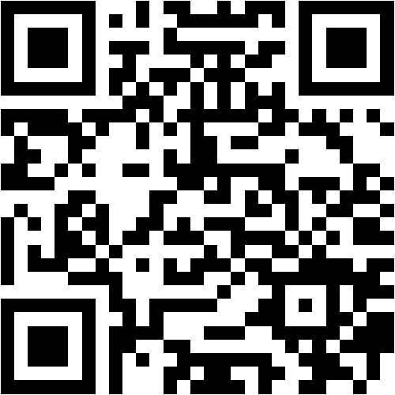
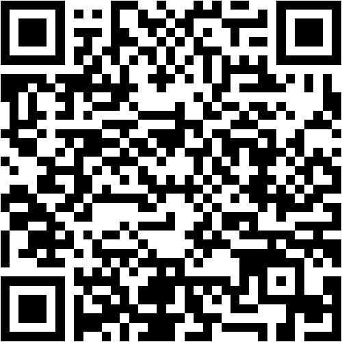
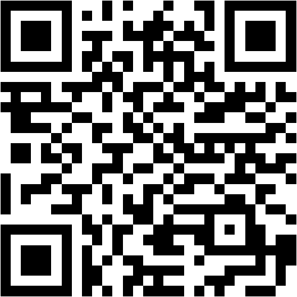
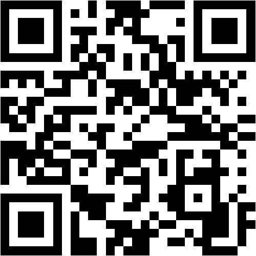
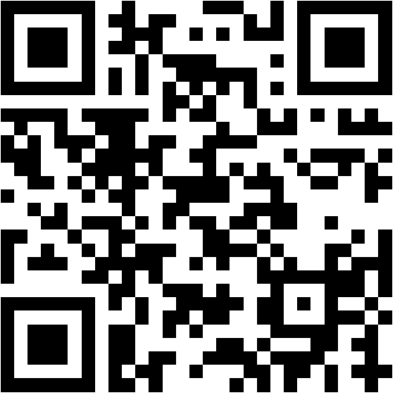
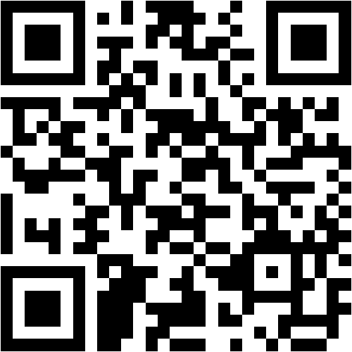
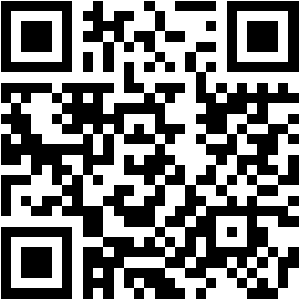
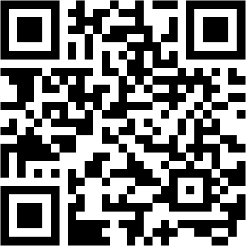

### Hi there, I'm Ivan Pinatti 👋

I'm a jack-of-all-trades in the IT world, working most of the time as a Solutions Architect. I love building things, sharing knowledge, and helping others solve problems.

If you find any of my projects or contributions useful, or just want to say hi, feel free to [reach out](https://www.linkedin.com/in/ivanpinatti/) or connect on [Twitter](https://twitter.com/intent/follow?screen_name=ivan_pinatti). I'm always open to new opportunities, whether it's collaborating, hiring me for a project, or just chatting about tech.

If you'd like to support my work (which I do mostly in my spare time), a small donation, coffee, or sponsorship would mean a lot and help me keep creating and sharing. Thank you! 😊

| BTC | ETH | ADA | BCH | DOGE | LTC | XRP | ATOM | KAVA |
|:---:|:---:|:---:|:---:|:----:|:---:|:---:|:----:|:----:|
|  |  |  |  |  |  |  |  |  |

**Cryptocurrency** ([all addresses](docs/crypto/addresses.md))
